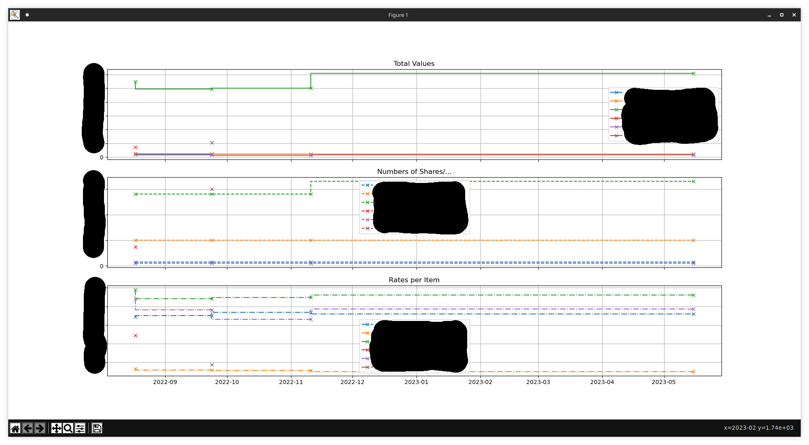

## DKB Stock Portfolio CSV Parser

The German DKB bank offers an option to dump a report about your current stocks/shares/... as a CSV. I found it a bit hard to keep track of them in a spreadsheet, so I made a needlessly complicated python program.

#### How to Use

In the web interface, click on the three dots on "Depot" and export to CSV. Save/collect all CSVs in a folder, and run this program. Multiple plots are possible, see screenshot for example..

```
$ ./parse.py -h
usage: parse.py [-h] -f F [-t] [-n] [-r] [-d]

Small parser/visualization tool for the DKB stock/portfolio CSV export

optional arguments:
  -h, --help  show this help message and exit
  -f F        path to the folder with the csv [f]iles
  -t          draw [t]otal values
  -n          draw [n]umber of shares/...
  -r          draw [r]ate of items
  -d          [d]ump parsed data (for debugging)
```

#### Screenshot

